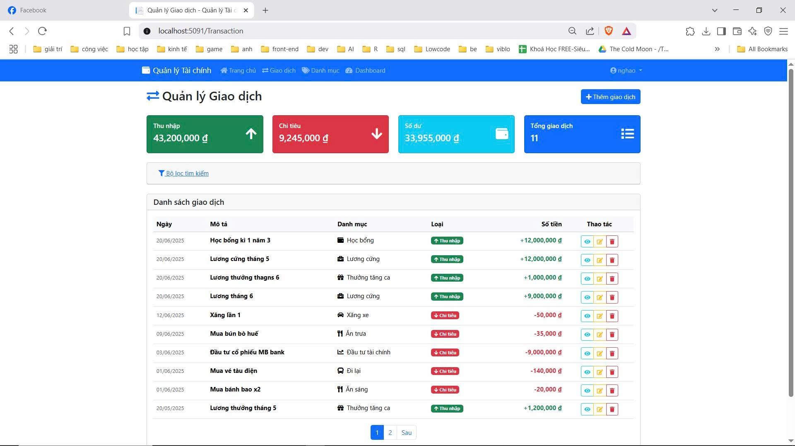
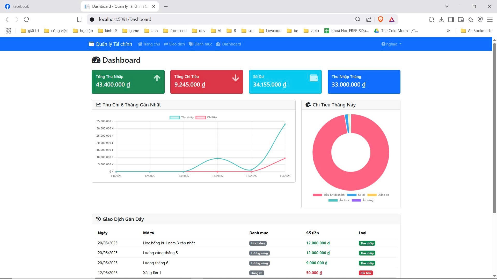
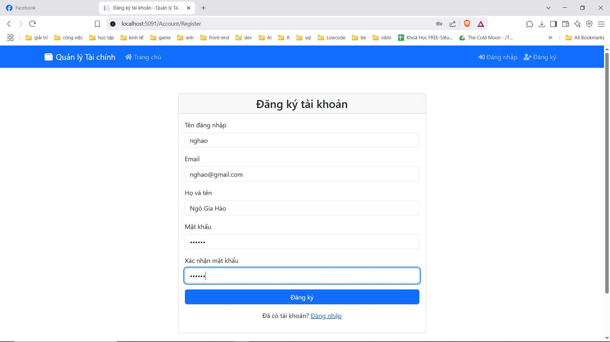
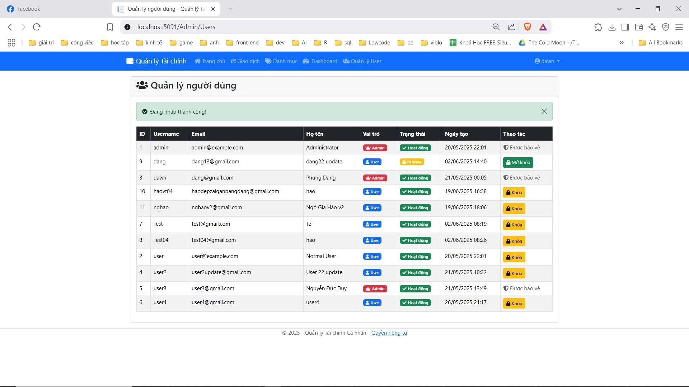
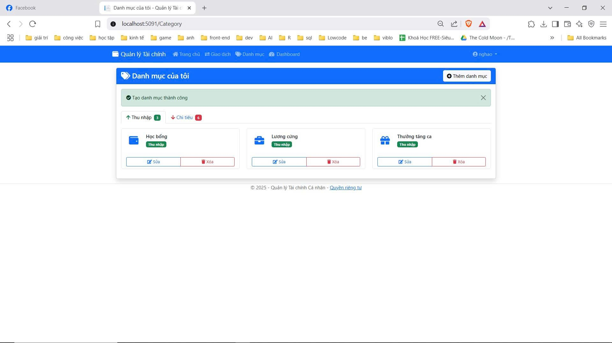
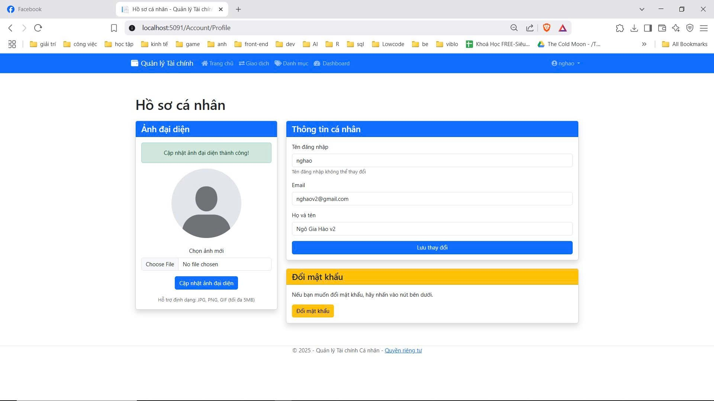

# FinacialProjectVersion3

## Tổng quan

FinacialProjectVersion3 là một hệ thống quản lý tài chính được xây dựng trên nền tảng ASP.NET Core, cung cấp các công cụ và tính năng hỗ trợ quản lý, phân tích và theo dõi thông tin tài chính. Hệ thống được thiết kế với giao diện người dùng thân thiện và cơ sở dữ liệu SQL Server mạnh mẽ để đáp ứng các nhu cầu quản lý tài chính hiện đại.

## Công nghệ sử dụng

- **Backend**: C# / ASP.NET Core (53.3%)
- **Frontend**: HTML (40.3%)
- **Database**: TSQL / SQL Server (5.7%)
- **Khác**: (0.7%)

## Tính năng chính

- Quản lý thu chi và dòng tiền
- Theo dõi ngân sách và chi tiêu
- Báo cáo tài chính với biểu đồ trực quan
- Quản lý tài sản và nợ
- Bảo mật dữ liệu tài chính cá nhân

## Yêu cầu hệ thống

- .NET Core SDK 6.0 trở lên
- SQL Server 2019 trở lên
- Visual Studio 2022 (khuyến nghị cho phát triển)

## Cài đặt và thiết lập

### 1. Clone repository

```bash
git clone https://github.com/dawnmoriaty/FinacialProjectVersion3.git
cd FinacialProjectVersion3
```

### 2. Cài đặt các gói phụ thuộc

```bash
dotnet restore
```

### 3. Thiết lập cơ sở dữ liệu

- Mở SQL Server Management Studio
- Tạo một cơ sở dữ liệu mới
- Chạy script trong thư mục `Database/Scripts` để khởi tạo cấu trúc dữ liệu
- Hoặc sử dụng Entity Framework migrations:

```bash
dotnet ef database update
```

### 4. Cập nhật connection string

Mở file `appsettings.json` và cập nhật chuỗi kết nối đến cơ sở dữ liệu:

```json
{
  "ConnectionStrings": {
    "DefaultConnection": "Server=YOUR_SERVER;Database=FinancialDB;Trusted_Connection=True;MultipleActiveResultSets=true"
  }
}
```

### 5. Chạy ứng dụng

```bash
dotnet run
```

Sau khi khởi động, ứng dụng sẽ chạy trên địa chỉ: `https://localhost:5001`

## Cấu trúc dự án

```
FinacialProjectVersion3/
├── Controllers/        # Các controllers xử lý requests
├── Models/             # Các model dữ liệu
├── Views/              # Giao diện người dùng (HTML)
├── Services/           # Các dịch vụ nghiệp vụ
├── Repositories/       # Lớp truy xuất dữ liệu
├── Migrations/         # EF Core migrations
├── wwwroot/            # Tài nguyên tĩnh (CSS, JS, images)
├── Database/           # Scripts và tài liệu về database
├── appsettings.json    # Cấu hình ứng dụng
└── Program.cs          # Điểm khởi đầu ứng dụng
```

## Hướng dẫn sử dụng

### Đăng nhập hệ thống
- Truy cập ứng dụng tại `https://localhost:5001`
- Đăng nhập với tài khoản có sẵn hoặc đăng ký mới
- Tài khoản admin mặc định: `admin@finance.com` / Mật khẩu: `Admin@123`

### Quản lý thu chi
- Vào mục "Quản lý giao dịch" để thêm, sửa, xóa các khoản thu chi
- Phân loại giao dịch theo danh mục
- Đính kèm hóa đơn/chứng từ (nếu cần)

### Báo cáo và phân tích
- Truy cập tab "Báo cáo" để xem các báo cáo tài chính
- Sử dụng các bộ lọc để phân tích dữ liệu theo thời gian, danh mục...
- Xuất báo cáo dưới dạng PDF hoặc Excel

## Ảnh chụp màn hình (Screenshots)
Dưới đây là một số ảnh chụp màn hình từ giao diện ứng dụng. Các ảnh nằm trong thư mục `ScreenShoot` của dự án.

- Dashboard (Tổng quan)

  

- Dashboard (Alternate)

  

- Đăng nhập (Login)

  

- Quản lý tài khoản admin (Admin Manager)

  

- Quản lý danh mục (Category)

  

- Trang hồ sơ người dùng (Profile)

  

## Phát triển

### Môi trường phát triển
- Visual Studio 2022
- .NET 6.0 SDK
- SQL Server Management Studio

### Quy trình đóng góp
1. Fork repository
2. Tạo một branch mới (`git checkout -b feature/amazing-feature`)
3. Commit các thay đổi (`git commit -m 'Thêm tính năng XYZ'`)
4. Push đến branch (`git push origin feature/amazing-feature`)
5. Tạo Pull Request

## Liên hệ

Dawn Moriaty - [GitHub](https://github.com/dawnmoriaty)

Project Link: [https://github.com/dawnmoriaty/FinacialProjectVersion3](https://github.com/dawnmoriaty/FinacialProjectVersion3)

## Giấy phép

Dự án này được cấp phép theo Giấy phép MIT - xem file `LICENSE.md` để biết chi tiết.
